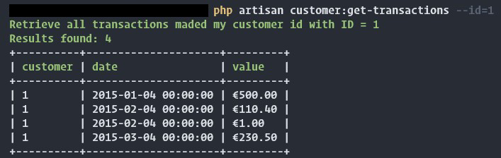

DOCUMENTAZIONE
====================

### Installazione

Il progetto è stato creato con framework Laravel. 

Sono stati rimossi tutti i files non utili al progetto, gli unici file rimanenti servono al funzionamento del framework stesso.

Per installare e usare il progetto basta posizionarsi sulla root del progetto e lanciare il comando 
```composer install```.

### Come eseguire il comando richiesto

Una volta installate le dipendenze è possibile usare il comando ```php artisan customer:get-transactions --id={id}``` per visualizzare tramite command line tutte le transazioni trovate per quel determinato customer-id.



I file che viene eseguito si trova ```App/Console/Commands``` mentre i model che vengono utilizzati si possono trovare in ```App/Models```.

### Come eseguire i test

Questo è il comando per eseguire i test 
```php artisan test```

Sono stati creati 8 test per testare le singole funzionalità degli oggetti creati.

In alcuni casi i test sono strutturati per fare prove multiple con valori diversi in modo da poter testare facilmente più casistiche senza dover creare un testcase in più.

I file possono essere trovati dentro ```tests/Unit```